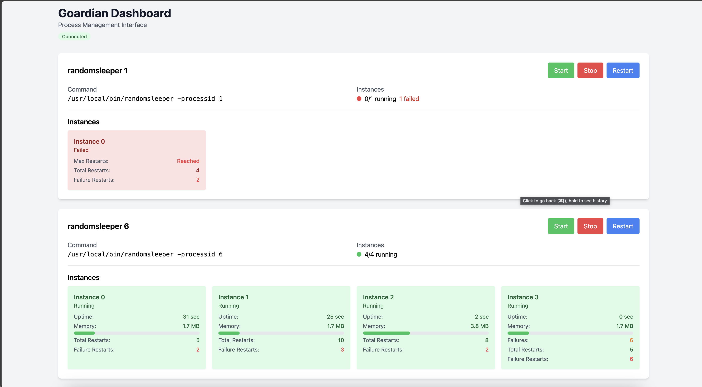

# Goardian

Goardian is a process supervisor and monitoring tool written in Go. It provides a robust way to manage and monitor multiple processes, with features like automatic restarts, graceful shutdowns, Prometheus metrics integration, and a responsive web dashboard.



## Features

- Process supervision with automatic restarts
- Multiple process instances support
- Graceful shutdown handling
- Responsive web dashboard for real-time monitoring and control
- Automatic restart limiting with configurable max_restarts
- WebSocket-based real-time updates
- Prometheus metrics for monitoring
- Configurable process environment and working directory
- Support for normal exit codes
- Process runtime tracking
- Memory usage monitoring
- Structured logging with color-coded output
- Subprocess output capture and logging

## Installation

```bash
go install github.com/sorinpanduru/goardian/cmd/goardian@latest
```

## Usage

Create a configuration file (e.g., `config.yaml`):

```yaml
log_format: "console"  # or "json" for JSON format
metrics_addr: ":9090"
web_addr: ":8080"      # Web dashboard address
shutdown_delay: "10s"

processes:
  - name: "web-server"
    command: "python"
    args: ["app.py"]
    working_dir: "/app"
    environment:
      - "PYTHONPATH=/app"
    start_timeout: "30s"
    stop_timeout: "10s"
    restart_delay: "5s"
    max_restarts: 5
    numprocs: 2
    exit_codes: [0, 1]  # These exit codes will trigger an immediate restart without backoff
```

Run Goardian:

```bash
goardian -config config.yaml
```

## Web Dashboard

Goardian includes a responsive web dashboard that provides real-time monitoring and control of your processes. The dashboard is accessible at `http://localhost:8080` (or the address you specify with `web_addr` in your config).

### Dashboard Features:

- **Real-time Process Monitoring**: View the current state of all processes and instances
- **Process Control**: Start, stop, and restart processes with a click
- **Performance Metrics**: Monitor memory usage and uptime for each process instance
- **Restart Statistics**: Track total restarts and failure restarts
- **WebSocket-based Updates**: Get real-time updates without page refreshes
- **Automatic Reconnection**: Resilient WebSocket connection with automatic reconnection
- **Status Indicators**: Visual indicators for running, stopped, and failed states

The web dashboard makes it easy to manage your processes without the need for command-line tools or manual configuration.

## Process States

Processes in Goardian can be in one of the following states:

- **Running**: Process is active and will be automatically restarted on failure
- **Stopped**: Process was manually stopped and will not be automatically restarted
- **Failed**: Process has reached the maximum number of restart attempts (`max_restarts`)

## Logging

Goardian provides structured logging with two output formats:

### Console Format
When `log_format: "console"` is set, logs are displayed with:
- Color-coded log levels (green for INFO, red for ERROR, yellow for WARN, gray for DEBUG)
- Timestamp in readable format
- Process name and instance information
- Structured attributes for additional context
- Subprocess output capture with stream type (stdout/stderr)

Example console output:
```
[2024-03-21 10:00:00] INFO: process started
  process=web-server instances=2

[2024-03-21 10:00:01] INFO: process output
  process=web-server stream=stdout instance=0 type=subprocess_output
  Starting server on port 8080
```

### JSON Format
When `log_format: "json"` is set, logs are output in JSON format for machine parsing:
```json
{"time":"2024-03-21T10:00:00Z","level":"info","msg":"process started","process":"web-server","instances":2}
```

## Metrics

Goardian exposes the following Prometheus metrics at the `/metrics` endpoint:

- `goardian_process_restarts_total`: Counter of process restarts
- `goardian_process_failure_restarts_total`: Counter of process restarts due to failures
- `goardian_process_uptime_seconds`: Gauge showing process uptime
- `goardian_process_memory_bytes`: Gauge showing process memory usage
- `goardian_process_status`: Gauge showing process status (2=failed, 1=running, 0=stopped)
- `goardian_process_runtime_seconds`: Histogram of process runtime durations

Example Prometheus configuration:

```yaml
scrape_configs:
  - job_name: 'goardian'
    static_configs:
      - targets: ['localhost:9090']
```

## Project Structure

```
goardian/
├── cmd/
│   └── goardian/
│       └── main.go           # Main entry point
├── internal/
│   ├── config/
│   │   └── config.go        # Configuration handling
│   ├── logger/
│   │   └── logger.go        # Structured logging with color support
│   ├── metrics/
│   │   └── metrics.go       # Prometheus metrics
│   ├── process/
│   │   └── process.go       # Process management
│   └── web/
│       ├── server.go        # Web server for dashboard
│       ├── websocket.go     # WebSocket server for real-time updates
│       └── static/          # Web UI assets
├── go.mod
└── README.md
```

## Configuration

### Global Configuration

- `log_format`: Log output format ("json" or "console")
- `metrics_addr`: Address to expose Prometheus metrics
- `web_addr`: Address for the web dashboard
- `shutdown_delay`: How long to wait for processes to shutdown

### Process Configuration

- `name`: Process name (used in logs and metrics)
- `command`: Command to execute
- `args`: Command arguments
- `working_dir`: Working directory for the process
- `environment`: Environment variables
- `start_timeout`: How long to wait for process to start
- `stop_timeout`: How long to wait for process to stop
- `restart_delay`: Delay between restarts
- `max_restarts`: Maximum number of restarts before marking as failed
- `numprocs`: Number of process instances to run
- `exit_codes`: List of normal exit codes that trigger an immediate restart without backoff

## Docker

### Building the Image

To build the Docker image:

```bash
docker build -t goardian .
```

### Running the Container

To run the container, you need to provide a configuration file. Mount your config file at runtime:

```bash
docker run -d \
  --name goardian \
  -p 9090:9090 \
  -p 8080:8080 \
  -v /path/to/your/config.yaml:/config.yaml \
  goardian
```

Replace `/path/to/your/config.yaml` with the path to your configuration file on the host machine.

### Example Configuration

Here's an example configuration file (`config.yaml`):

```yaml
log_format: "console"
metrics_addr: ":9090"
web_addr: ":8080"
shutdown_delay: "10s"
processes:
  - name: "example-process"
    command: "/usr/local/bin/example"
    args: ["--flag", "value"]
    working_dir: "/app"
    environment:
      - "ENV_VAR=value"
    numprocs: 1
    start_timeout: "30s"
    stop_timeout: "10s"
    restart_delay: "5s"
    max_restarts: 5
    backoff_enabled: true
    backoff_factor: 1.5
    backoff_max_delay: "1m"
    exit_codes: [0]
```

### Container Features

- Minimal image size using multi-stage builds
- Statically linked binary for better security
- No shell or OS utilities (scratch base image)
- Metrics exposed on port 9090
- Web dashboard exposed on port 8080
- Configuration mounted at runtime

## License

GNU General Public License v3.0 (GPL-3.0) 